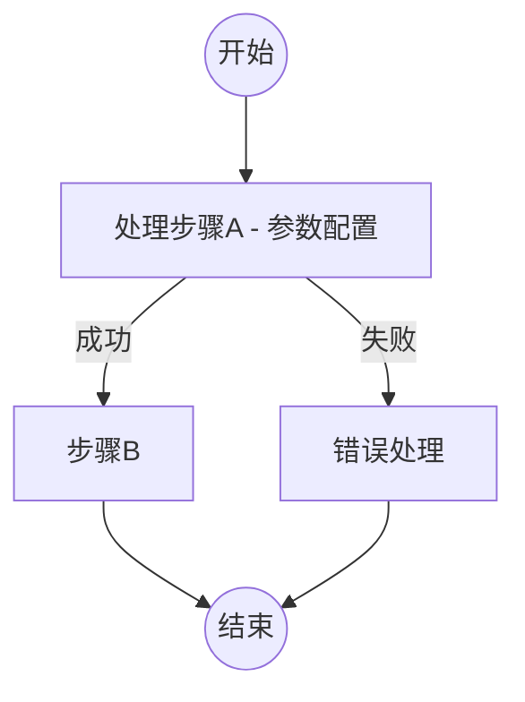
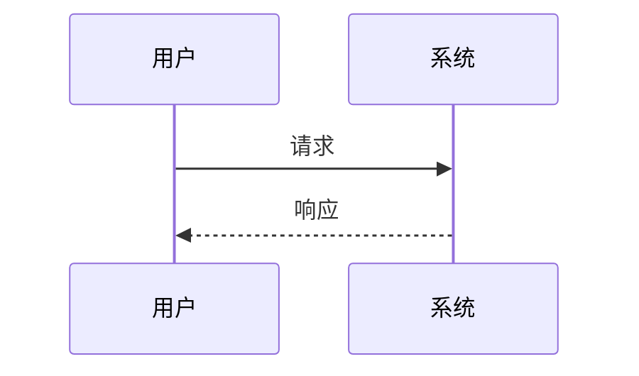

# 开源项目技术调研报告模板

> 本模板提供精炼的5章报告结构，按"是什么→怎么运作→核心实现→生态扩展→评估"逻辑展开。
> 根据项目类型选择对应的章节组合和架构视角，避免内容重叠。

---

## 报告结构总览

| 章节 | 主题 | 核心内容 |
|------|------|---------|
| 一、概述与背景 | 是什么、为什么 | 定位、背景、痛点、竞品、设计目标与约束 |
| 二、核心架构 | 怎么运作 | 架构图、设计原则、目录结构、核心流程、项目类型特有视角 |
| 三、核心技术实现 | 具体技术细节 | 算法/模型、关键模块深入、数据模型 |
| 四、扩展与生态 | 如何扩展、谁来用 | 扩展机制、社区、部署运维 |
| 五、质量与评估 | 好不好用 | 代码质量、优劣势、适用场景、选型建议 |

---

## 项目类型与章节选择

不同项目类型的章节侧重不同，按需裁剪标注 `【可选】` 的子节：

| 项目类型 | 二、核心架构重点 | 三、技术实现重点 | 常跳过 |
|---------|----------------|----------------|--------|
| **框架** | 两层架构：框架自身 + 框架承载的实现；核心流程；扩展点 | 框架承载的具体实现细节 | 部署、安全 |
| **库/SDK** | 模块划分；API 设计；依赖关系 | 核心算法/数据结构 | 部署、运维 |
| **工具类** | CLI 流程；配置体系；核心用例 | 关键功能实现 | 数据模型、安全 |
| **应用系统** | 分层架构；部署架构；核心用例 | 业务逻辑；数据模型 | — |
| **中间件** | 分层架构；数据流；部署架构 | 存储引擎；协议实现 | — |
| **算法库** | 模块划分；算法流程 | 算法原理；复杂度分析 | 部署、安全、运维 |

---

## 一、概述与背景

### 1. 项目概述

#### 1.1 项目定位与核心价值
- 项目名称、GitHub 地址
- 一句话描述项目目标
- 核心价值主张

#### 1.2 项目背景与起源
- 项目起源与发展历史
- 所属领域

#### 1.3 解决的核心问题
- 目标痛点
- 解决方案核心思路

#### 1.4 目标用户与使用场景
- 目标用户群体
- 典型使用场景

#### 1.5 项目成熟度评估
- Star 数、Fork 数、Contributor 数量
- 当前版本号、开源时间、最后活跃时间
- 版本发布节奏

### 2. 设计动机与目标

#### 2.1 设计动机
- 为什么要开发这个项目
- 当时市场上缺少什么解决方案

#### 2.2 与竞品的差异化定位
- 竞品列表与核心差异化优势

#### 2.3 核心设计目标与技术约束
- 设计目标及优先级排序
- 关键技术约束与取舍理由

---

## 二、核心架构

> 本章聚焦项目的**整体运作方式**——架构、流程、结构。技术实现细节在第三章展开，避免重叠。

### 3. 整体架构

#### 3.1 架构概览

**架构图**（根据项目类型选择合适的表达方式）：

| 项目类型 | 推荐架构图类型 | 描述重点 |
|---------|-------------|---------|
| 框架 | 核心流程图 + 扩展点图 | 框架如何驱动、扩展点在哪 |
| 库/SDK | 模块依赖图 + API 结构图 | 模块职责、依赖方向 |
| 工具类 | CLI 流程图 + 数据流图 | 输入→处理→输出 |
| 应用系统 | 分层架构图 + 部署架构图 | 服务划分、通信方式 |
| 中间件 | 分层架构图 + 数据流图 | 协议层、存储层、接口层 |
| 算法库 | 算法流程图 | 处理阶段、数据流 |

**架构设计原则**：
- 核心设计原则（2-5条）
- 设计原则在代码中的体现

#### 3.2 项目类型分层视角

> 框架类项目特别重要：需要区分"框架自身的架构"和"框架承载的实现的架构"。

**框架类项目**（如 autoresearch、PyTorch、LangChain）：
- **框架层**：框架自身的核心循环/管道/事件机制、扩展点定义、用户配置入口
- **实现层**：框架承载的具体业务实现（模型、算法、处理器等）
- 两层的交互方式：框架如何调用实现、实现如何注册到框架

**库/SDK类项目**：
- 对外暴露的 API 边界
- 内部模块划分与依赖关系
- 核心数据结构

**工具类项目**：
- CLI 命令结构与流程
- 配置文件体系
- 输入/输出边界

**应用系统类项目**：
- 分层架构（展示层/业务层/数据层）
- 服务间通信方式
- 部署拓扑

#### 3.3 项目目录结构

```
project/
├── src/           # 源代码
├── tests/         # 测试代码
└── ...
```

- 各目录职责说明
- 命名规范

#### 3.4 关键接口概览

对内/对外暴露的主要接口、常量、配置项。

### 4. 核心流程

#### 4.1 核心用例
- 主要业务场景列表与优先级

#### 4.2 核心流程图/时序图
- 关键场景的交互流程
- 组件间调用时序

#### 4.3 状态流转 【可选】
- 有状态实体的状态机
- 状态转换条件

#### 4.4 端到端工作流 【可选】
- 用户从零开始使用项目的完整流程

---

## 三、核心技术实现

> 本章深入技术细节——算法、模型、优化器、数据结构等。框架类项目在此展开"实现层"的内容。

### 5. 核心算法与模型 【可选 - 适用于涉及算法/模型的项目】

#### 5.1 算法/模型原理
- 背景与理论基础
- 数学模型/公式
- 伪代码或流程描述

#### 5.2 算法流程图

#### 5.3 复杂度分析 【可选】
- 时间/空间复杂度、瓶颈分析

### 6. 关键模块实现

#### 6.1 核心模块实现原理
- 选2-3个核心模块深入分析
- 设计思路与实现细节

#### 6.2 关键数据结构
- 核心数据结构定义与选择原因

#### 6.3 核心代码路径分析
- 关键功能的代码执行路径
- 重要函数/方法解析

#### 6.4 创新点与亮点
- 技术创新点、工程实践亮点、值得借鉴的设计

### 7. 数据模型与存储 【可选 - 适用于涉及数据存储的项目】

#### 7.1 核心数据实体与关系
- 实体定义、属性说明
- ER图（如适用）

#### 7.2 存储方案
- 数据库选型与理由
- 缓存策略（如适用）

---

## 四、扩展与生态

### 8. 扩展机制

#### 8.1 插件/扩展系统 【可选】
- 插件架构设计、扩展点定义、加载机制

#### 8.2 API 与集成
- 对外 API 设计（REST/GraphQL/gRPC）
- 第三方集成方式

#### 8.3 配置与自定义
- 配置文件结构、环境变量、自定义方式

### 9. 社区与生态

#### 9.1 社区活跃度
- 贡献者结构、讨论活跃度、文档完善程度

#### 9.2 第三方生态
- 官方/社区插件列表、Notable Forks

### 10. 部署与运维 【可选 - 适用于需独立部署的项目】

- 部署方式（Docker/K8s/二进制等）
- 环境要求
- 监控与日志
- CI/CD 流程

---

## 五、质量与评估

### 11. 代码质量

- 代码规模（行数、文件数、语言占比）
- 代码风格与规范
- 测试体系（框架、类型、覆盖率）

### 12. 技术评估

#### 12.1 技术优势
- 架构优势、性能优势、易用性优势、生态优势

#### 12.2 技术劣势与风险
- 架构缺陷、性能瓶颈、技术债务、潜在风险

#### 12.3 适用场景建议
- 推荐使用场景、不推荐使用场景、使用注意事项

#### 12.4 选型决策建议
- 选型评估矩阵（可选）
- 与竞品对比（可选）

---

## 附录

### A. 参考资源
- 官方文档、源码仓库、相关论文/博客

### B. 术语表 【可选】
- 项目特定术语解释、缩写对照表

### C. 调研信息
- 调研人、调研时间、调研版本

---

## Mermaid 语法兼容性规则

**必须遵守**，确保图表在 GitHub、GitLab、Typora、VS Code 等渲染器中均可正常显示：

| 规则 | 正确 | 错误 |
|------|------|------|
| 节点文字换行 | 用 ` - ` 连字符分隔 | 不用 `<br/>` 标签 |
| 连线标签 | `-->|label|` 简洁形式 | 不用 `-->|"label"|` 引号语法 |
| 特殊字符 | `x`、`+/-`、`>=` | 不用 `×`、`±`、`≥` |
| subgraph 名称 | 用双引号 `subgraph "名称"` | 不用无引号含空格的名称 |
| 状态图 | 用 `flowchart TB` | 不用 `stateDiagram-v2` |
| 象限图 | 用表格 + flowchart | 不用 `quadrantChart` |

**推荐图表类型**：`graph TB/LR`、`flowchart TB/LR`、`sequenceDiagram`、`classDiagram`、`erDiagram`

**图表示例**：





---

*模板版本: v2.0*
*最后更新: 2026-06*
*核心改进: 5章精炼结构、项目类型分层视角、Mermaid兼容性规则*
